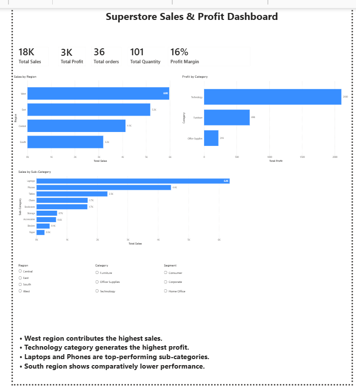
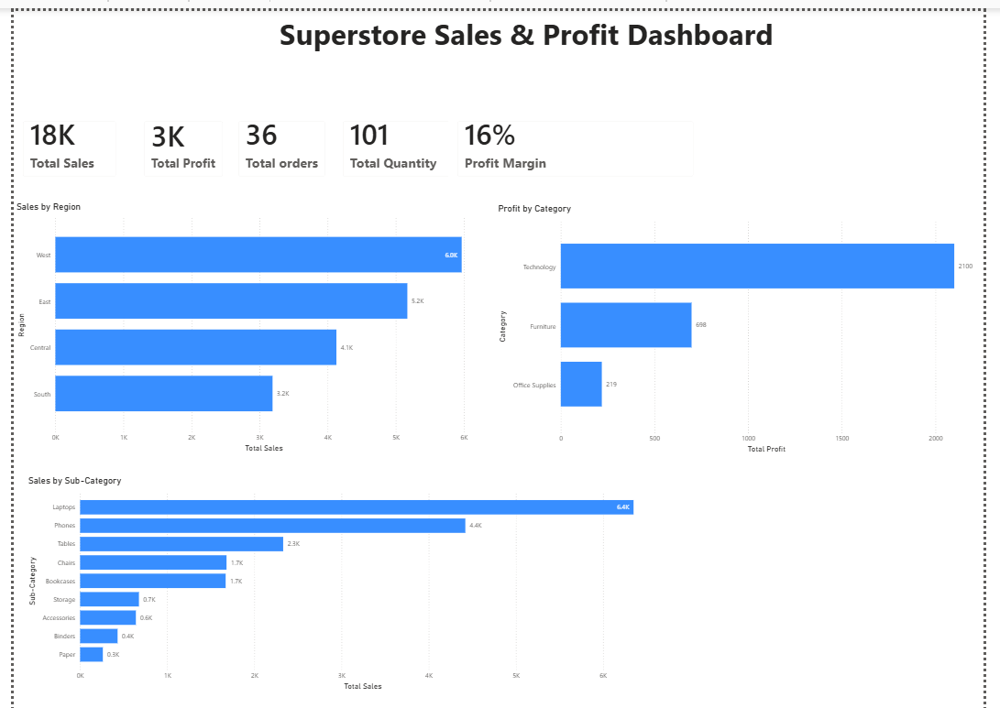
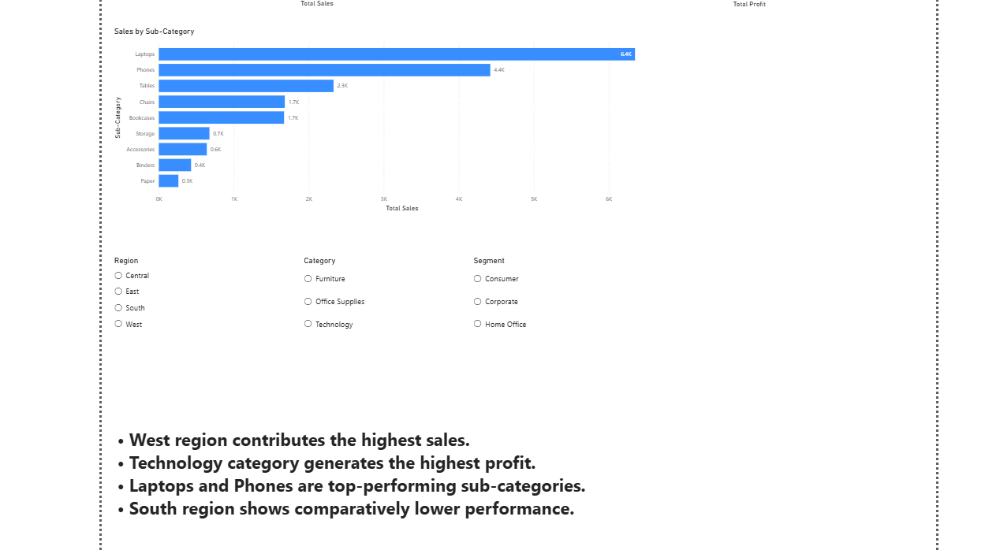

# 📊 Superstore Sales & Profit Dashboard (Power BI)

## 📌 Project Overview

This project presents an interactive Power BI dashboard analyzing retail sales, profit, and customer trends using the Superstore dataset. The dashboard provides clear and actionable insights into business performance across regions, categories, and products to support data-driven decision-making.

---

## 🎯 Objectives

* Analyze total sales and profit performance
* Identify top-performing regions and product categories
* Understand sub-category level sales distribution
* Evaluate order volume and quantity trends
* Build an interactive dashboard for business insights

---

## 🛠️ Tools & Technologies

* **Power BI Desktop**
* **Power Query (ETL & Data Cleaning)**
* **DAX (Data Analysis Expressions)**
* **Excel Dataset**

---

## 📈 Key Metrics

* Total Sales
* Total Profit
* Total Orders
* Total Quantity
* Profit Margin (%)

---

## 📊 Dashboard Features

* KPI cards for a quick business overview
* Sales analysis by region
* Profit analysis by category
* Sales breakdown by sub-category
* Interactive slicers (Region, Category, Segment)
* Clean and user-friendly layout

---

## 🔍 Key Insights

* The **West region** contributes the highest share of total sales
* The **Technology category** generates the highest profit
* **Laptops and Phones** are top-performing sub-categories
* The **South region** shows comparatively lower performance

---

## 📸 Dashboard Preview

### 🔹 Main Dashboard



### 🔹 Additional Views




---

## 📁 Project Structure

```text
superstore-powerbi-dashboard/
│
├── superstore-powerbi-dashboard.pbix   # Power BI dashboard file
├── superstore_sample.csv.xlsx          # Dataset used
├── main dashboard 1.png                # Main dashboard screenshot
├── dashboard 2.png                    # Additional screenshot
├── dashboard 3.png                    # Additional screenshot
└── README.md
```

---

## 🚀 Business Value

This dashboard helps stakeholders quickly identify high-performing regions, detect underperforming segments, and make informed decisions to improve overall business performance and profitability.

---

## 💡 Skills Demonstrated

* Data Cleaning & Transformation (Power Query)
* Data Modeling & DAX Measures
* Data Visualization & Dashboard Design
* Business Insight Generation

---

## 📬 Contact

Feel free to connect or reach out for feedback and collaboration.

